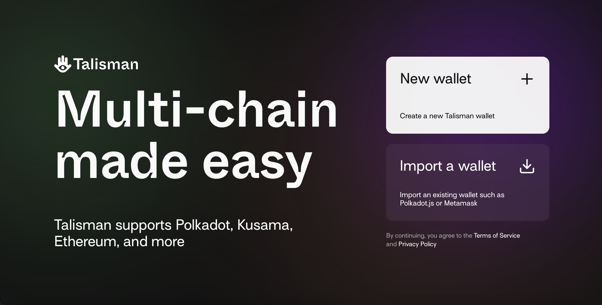
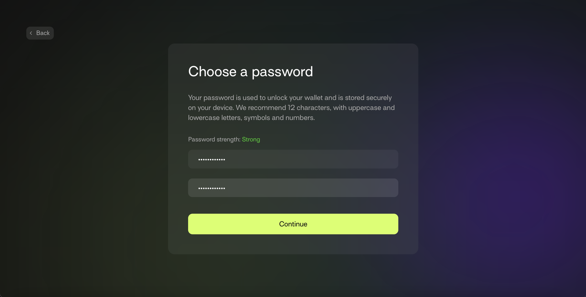
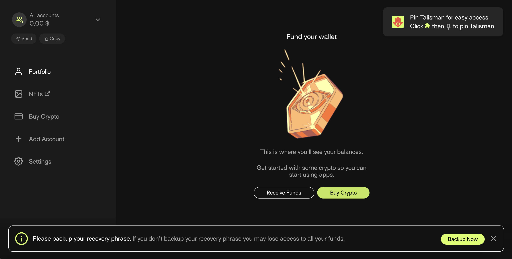
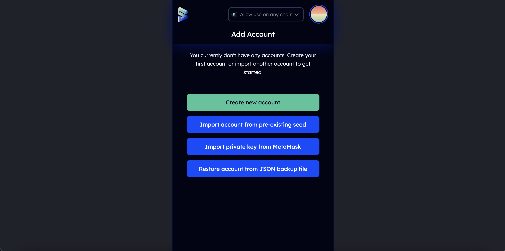
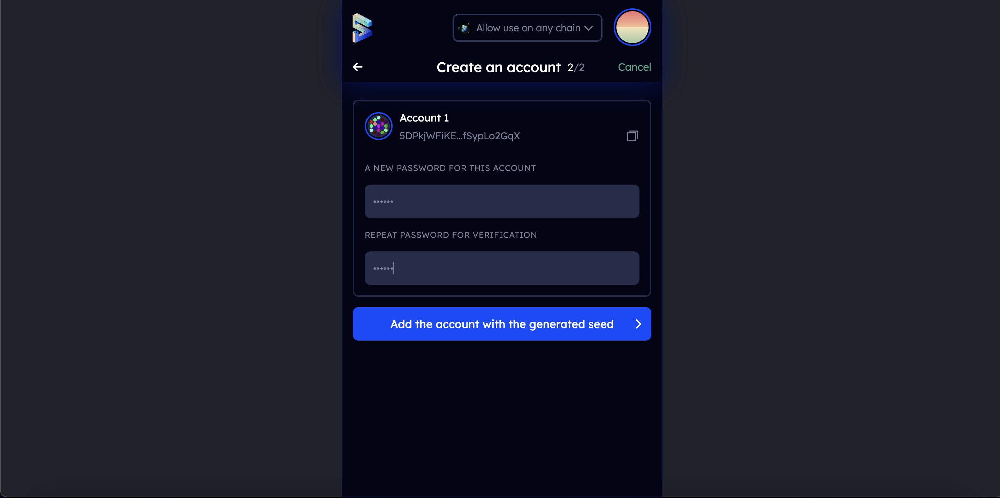

# 如何创建账户

## 关键信息和安全提示

帐户代表一种身份——通常是一个人或一个组织，能够进行交易或持有资金。用户可以上传智能合约，并通过建立在 Gear Protocol 之上的区块链网络进行交易。为了实现这一点，用户需要连接一个 Substrate 账户。Gear Idea  网站可以与任何连接的 Gear-powered 网络中的 Substrate 账户一起工作。此外，该账户可用于在 Dotsama 生态系统的任何网络中持有资金和进行交易，想了解更多，请点击此[链接](https://docs.substrate.io/fundamentals/accounts-addresses-keys/)。

有几种方法来创建一个 Substrate 账户，这取决于你是使用台式机还是移动设备。

一个账户主要有 2 个关键部分--地址和私钥：
- 地址是账户的公开部分。可以将它分享给他人，以便发送交易。
- 私钥是账户的私有部分。这是使你作为一个账户所有者能够访问地址的原因。访问你的账户的唯一方法是通过你的私钥（使用助记词，种子密码，或你的账户的 JSON 文件和一个密码）。

### 保存你的帐户

:::tip
**种子密码**
你的种子密码或助记词是你账户的钥匙。如果你丢失了种子密码，你将失去对你账户的访问。我们建议你将你的种子储存在安全的地方，如加密的硬盘、非数字设备，最好是纸张。永远不要与任何人分享你的私钥。
:::

:::tip
**JSON 文件**
JSON 文件是一个用密码加密的账户的备份。通过使用 JSON，你可以在任何钱包中 导入/恢复 你的账户。没有密码，你将无法恢复对你的账户的访问。如果你使用 JSON，请将文件和密码保存在一个安全的地方。
:::

## 如何创建账号

### 通过 Talisman 钱包

`Talisman` 是一个流行的和用户友好的钱包，用于创建和管理 Substrate 账户。Talisman 浏览器插件与各种网络中的 web3 应用程序相连，允许存储、发送和接收资产。

1. 通过 https://talisman.xyz/ 安装 tailsmain 插件

2. 通过点击菜单栏中的 logo，打开扩展程序。

3. 打开应用，点击 "New wallet"



4. 输入一个强密码



然后，你的地址已经创建好了：



### 通过 Subwallet

Subwallet 是另一个高级钱包，用于管理 Substrate 以及 EVM 账户。

1. 通过 https://subwallet.app/download.html 安装 Subwallet

2. 通过点击菜单栏中的 logo，打开 Subwallet

3. 点击 "Create new account":



4. 选择你想要创建的账户类型 (Subwallet 允许你同时创建 substrate 和以太坊的账户)。复制你的种子密码，并保持在相同的地方：


5. 在下一步中提供密码。点击 "Add the account with the generated seed"



恭喜，你的地址已经创建成功！

### 通过 Polkadot.js 插件

polkadot.js 浏览器扩展是 Parity Technologies 创建的用于管理 Substate 账户的原声应用。通过安装 polkadot.js 插件，并将其作为一个独立于浏览器的 "虚拟保险库"，用来以存储私钥和签署交易。

1. 你可以通过以下链接安装扩展。

- [Chromium](https://chrome.google.com/webstore/detail/polkadot%7Bjs%7D-extension/mopnmbcafieddcagagdcbnhejhlodfdd?hl=en)

- [FireFox](https://addons.mozilla.org/en-US/firefox/addon/polkadot-js-extension)

2. 通过单击菜单栏中的 logo 打开程序

3. 单击大加号按钮来创建一个新帐户。或者，你可以导航到右上角较小的加号图标，并选择“Create New Account”。

[img alt](./img/create-account-1.png)

4. 使用本文开头的安全建议将“种子密码”保存在安全的地方。


5. 设定帐户名称和用于进行交易的强密码。点击“Add the account with the generated seed”。


:::note
你在此选择的密码将用于加密此帐户的信息。尝试处理任何类型的转出交易或使用它对消息进行加密签名时，都需要重新输入它。此密码存储在本地浏览器扩展中。
:::

你现在已经使用 polkadot.js 浏览器扩展成功创建了一个新帐户。

### 通过手机应用

如果你需要在移动设备上访问帐户，那么你可以将以下移动钱包用于 Polkadot/Kusama 生态系统：

[](https://novawallet.io/)

[](https://subwallet.app/)

你可以在 [此处](https://wiki.polkadot.network/docs/build-wallets) 查看所有受支持的钱包。

### 通过控制台

如果你安装了`Gear node`，可以使用以下命令生成新的“种子密码”：

```sh
./gear key generate | grep phrase
```

然后将生成的助记词 `import` 到钱包中。


### 常见问题

#### 账户是便携式的吗？

>是的，只要你拥有种子短语或者账户的 JSON 文件，你就能在任何不同设备和钱包上访问你的账户

>与帐户关联的短语或 JSON 文件

#### 能在 `polkadot.js` 浏览器插件中进行交易吗？

>没有直接在 polkadot.js 浏览器扩展中进行交易的功能

>要进行交易，需要在浏览器上访问 [Gear Idea](https://idea.gear-tech.io)

>在进行任何交易之前，必须允许 Gear Idea 访问你的帐户

>浏览器扩展程序保存您的帐户信息。您可以选择哪些网站可以访问此信息
