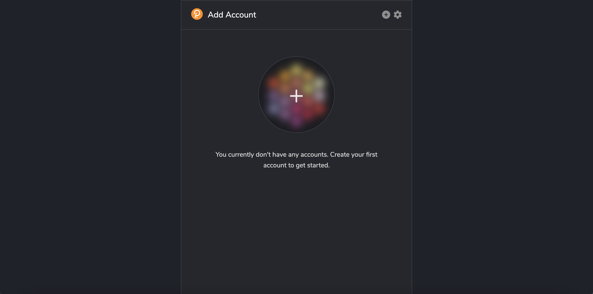
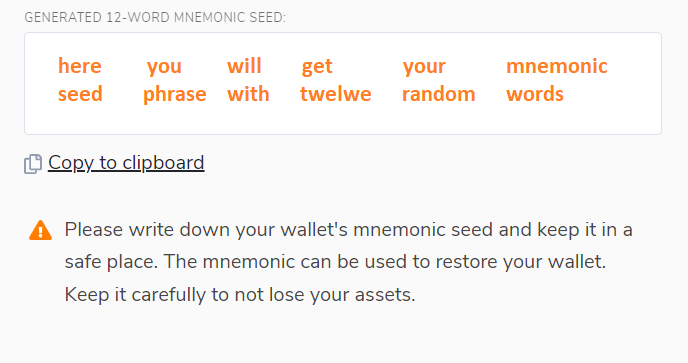
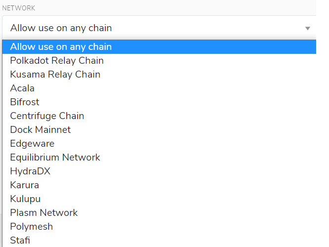
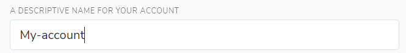
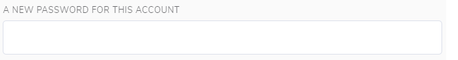

# 如何使用 polkadot.js 插件来创建 Substrate 账户

## 关键信息及安全

有多种生成 Substrate 或 Polkadot 账户的方法，但是目前最简单并且推荐的方法是使用 `polkadot.js` 这个浏览器插件。

组成账户的重要部分有两个：地址和私钥。地址是账户公开的方面，在本质上是向其发送交易的位置。私钥是账户的私有部分，使你能够访问你的地址。

访问你账户的唯一方法是通过你的助记词（mnemonic）或你的账户JSON文件及密码。确保这两个信息源的安全是至关重要的。如果你与任何人分享这些信息，他们就可以完全访问和控制你的账户，包括你所有的资金。

### 安全保存你的私钥

你的种子或助记词（mnemonic）是你的帐户的关键。如果更改设备、忘记密码或丢失JSON文件使你无法访问你的帐户，你可以使用种子恢复你的帐户。这也意味着如果其他人可以访问你的种子的话，他们也访问你的帐户。

我们建议你将种子储存在安全的地方，如加密的硬盘，非电子设备或理想的纸张。我们还建议采取其他安全措施，以防止该副本的物理损坏，例如火灾和水，并在不同的位置存储多份副本。

你不应该将你的种子存储在一个连接到互联网的设备上。

### 保存你的账户 JSON 文件

你帐户的 JSON 文件是用密码加密的。这意味着尽管你可以将其导入到任何钱包中，但你需要使用密码才能成功导入。因为有这个额外的安全层——密码——你不必在保护它时那么谨慎。然而，使用不用于其他任何用途的极其安全的密码是值得的。你应该离线记录这个密码。

## Polkadot.js 浏览器插件

`polkadot.js` 浏览器插件是创建 Substrate 账户的最简单和最安全的方法。这种方法需要安装 `polkadot.js` 浏览器插件，使用插件作为 `虚拟金库` 来将通过浏览器发送交易同存储私钥分开。

### 安装浏览器插件

该浏览器插件可以用于基于 Chromium 和 Firefox 的浏览器。

你可以使用以下链接来安装插件。

[Chromium](https://chrome.google.com/webstore/detail/polkadot%7Bjs%7D-extension/mopnmbcafieddcagagdcbnhejhlodfdd?hl=en)

[FireFox](https://addons.mozilla.org/en-US/firefox/addon/polkadot-js-extension)

一旦安装插件完成，你应该在菜单栏看到一个橙色和白色的 Polkadot 徽标。

### 创建账户

通过点击菜单栏上的徽标打开扩展，并单击大加号按钮来创建一个新帐户。或者，你可以导航到右上角较小的加号图标，并选择“创建新帐户”。

然后扩展将创建一个新的种子并展示成12个单词的形式，以方便你记录下来。

你应当按照本章节开头提到的方法来安全保存这个种子短语。

### 选择网络

接下来，点击“网络”下拉菜单，选择你想要创建帐户的网络。如果你目前没有网络首选项，请选择“允许在任何链上使用”。

### 命名账户

你选择的帐户名称仅供你使用。它不存储在区块链，它将不可见，除了你自己或任何人有访问这个帐户。如果你计划使用多个帐户，我们建议你尽可能详细地填写你的帐户名称，以避免将来的混淆。

### 输入密码

你在此选择的密码将用于加密该帐户的信息。当你试图处理任何类型的传出事务时，或者使用它对消息进行加密签名时，你将需要重新输入它。此密码存储在本地的浏览器扩展。

请注意，这个密码**并不保护**你的种子短语。

设置好密码后，点击“添加带有生成种子的帐户”。

现在，您已经成功地使用 `polkado .j` 浏览器插件创建了一个新帐户。

### 常见问题

这个账户是便携式的吗？

> 是的，只要你拥有种子短语或者账户的 JSON 文件，你就能在任何不同设备和钱包上访问你的账户

我能在 `polkadot.js` 浏览器插件里直接发起交易吗？

> 在 `polkadot.js` 浏览器插件里不能直接发起交易。发起交易需要你在浏览器中启动[polkadot.js apps](https://polkadot.js.org/apps/#/explorer)。
> 在你可以发起交易之前，你需要允许 `polkadot.js app` 访问你的账户。
> 浏览器插件保存你的账户信息，你需要选择哪些网站可以访问这些信息。