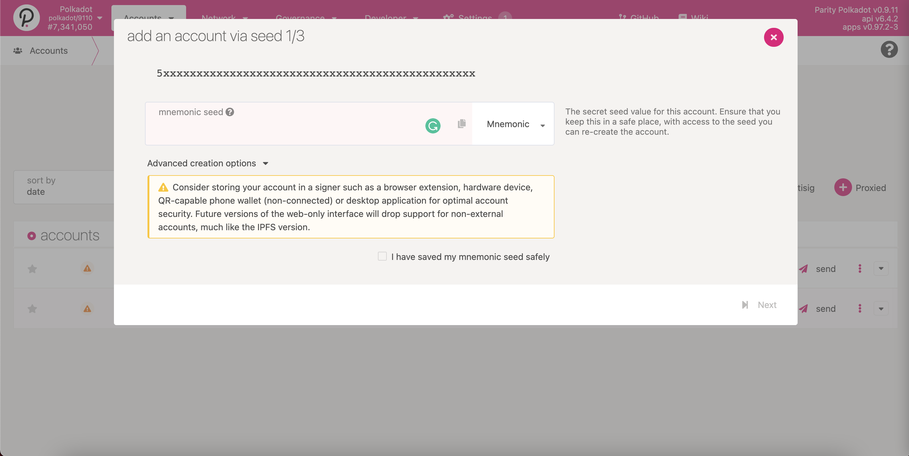
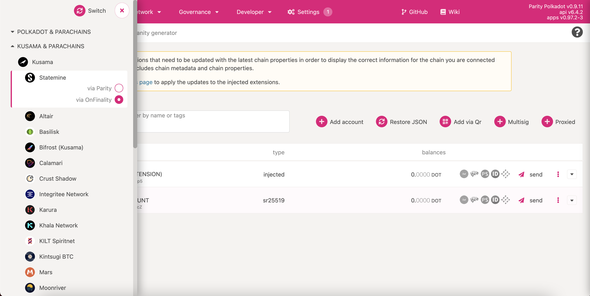
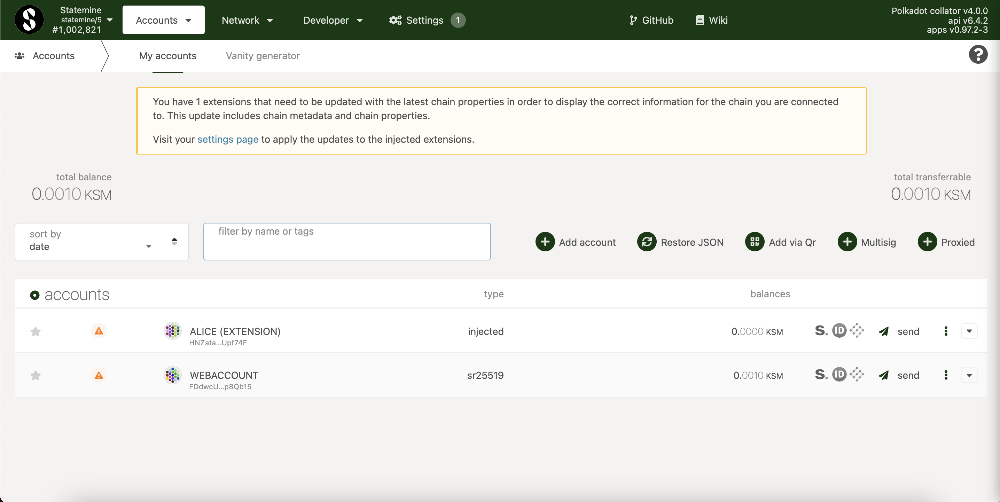

# 什么是 GRB？

在 Gear 准备推出先行（Canary）网络的同时，我们正在使用 Statemine 以 Gear Bonus 代币（GRB）来奖励活跃的社区成员，这些代币在未来可以兑换成 Gear 的主网代币。

要获得 GRB，你必须参加由 Gear 组织的活动和事件，如工作坊和 AMA 等。并非所有参与者都会仅仅因为参与而获得奖励。为了获得 GRB，个人必须成功地完成各种任务，例如在我们的一个工作坊中部署一个 DApp。

要申请你的GRB奖励，首先你必须下载 [polkadot.js](https://polkadot.js.org/extension/) 浏览插件并创建一个 Substrate 账户。你可以阅读一篇关于如何创建 Substrate 账户的深度文章 [这里](create-account.md)。

要了解你是否已经收到你的GRB，请使用以下选项之一：

# Gear 领取页面
1. Gear 提供了一个易于使用的界面来检查和申领可用的 GRB 代币 [claim.gear-tech.io/](https://claim.gear-tech.io/)。

2. 点击 "Connect" 按钮，连接你的有资格获得奖励代币的 Substrate 账户。

3. 如果可以申领 GRB，界面将显示一个 "Claim" 按钮。你的可用 GRB 余额将显示在右上角。

# Polkadot/Substrate 网站

在 Polkadot/Substrate 网站也可以检查你是否获得了 GRB 代币并访问它们。

## 步骤 1.

前往 [the Polkadot / Substrate Portal](https://polkadot.js.org/apps)。确保你的账户已经添加到钱包中，并可用于所有网络。

当添加一个账户时，你可以使用助记词组或从 JSON 中恢复地址。为此，需要使用先前保存 JSON 时创建的密码。

## 步骤 2.

要连接到 Statemine 网络，点击左上角的 Polkadot 图标，导航到 “Kusama & Parachains”，通过 OnFinality/ Parity 选择 Statemine。

你的账户现在应该显示在Statemine网络上：

## 步骤 3.

你的账户现在应该就会显示在 Statemine 网络上了：

然后，导航到 “Assets” 导航栏上的 “Balances”。

GEAR 奖金代币的 ID 是 677。当选择资产 677 时，将显示可用的 GRB 余额。

你还可以通过使用 https://www.subscan.io/ 来检查传入地址的交易，使用前，先在搜索菜单中选择 Statemine 网络。
