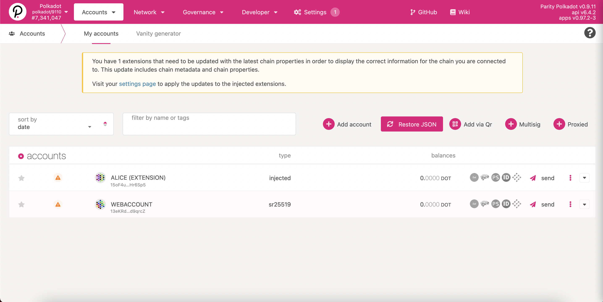
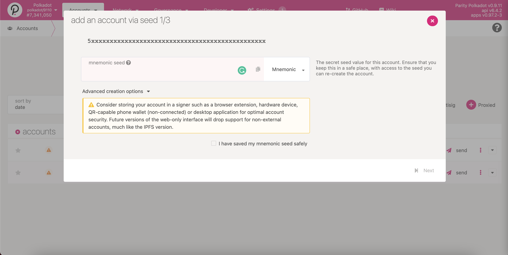
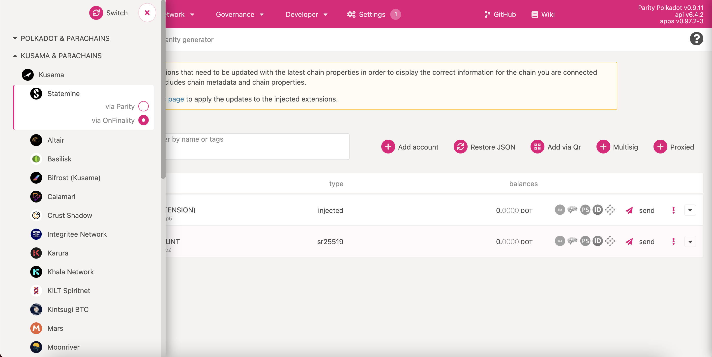
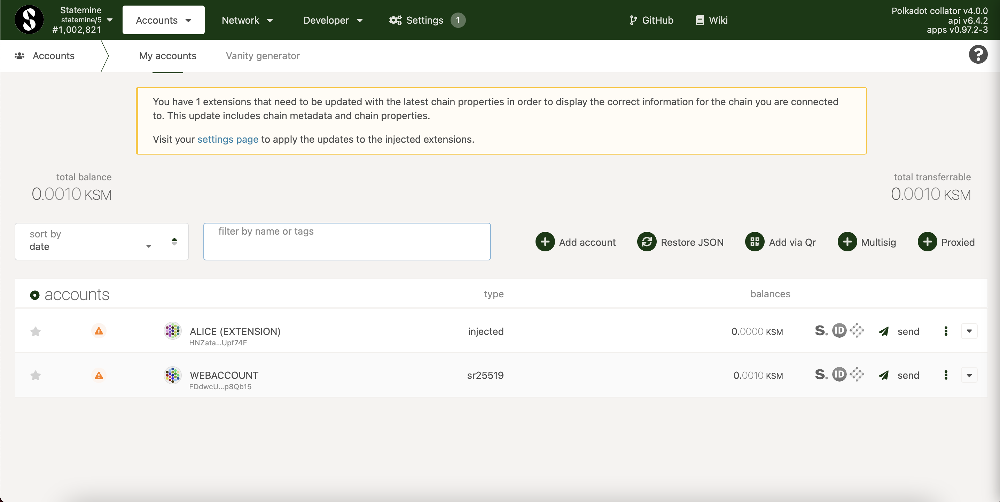
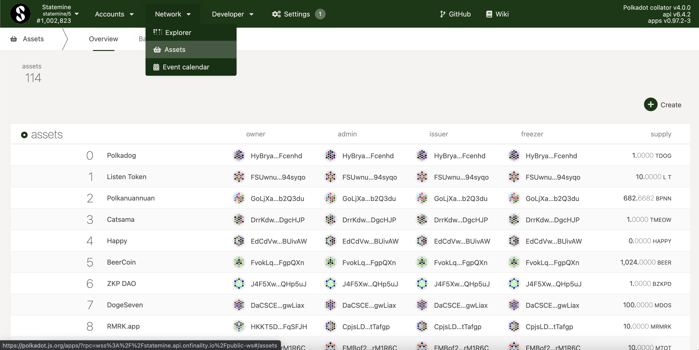

# 如何获取 Gear Bonus Token 

当 GEAR 准备推出 Canary 网络时，我们正在使用 Statemine 以 GEAR 代币(GRB) 来奖励我们社区的活跃成员 -- 将来可以兑换成原生的 GEAR 代币。

在这篇文章中，我们将演示如何检查你是否已经获得了 GRB 代币，以及如何获取这些代币。

## 步骤 1.

前往 [the Polkadot / Substrate Portal](https://polkadot.js.org/apps)。确保你的账户已经添加到钱包中，并可用于所有网络。

当添加一个账户时，你可以使用助记词组或从 JSON 中恢复地址。为此，需要使用先前保存 JSON 时创建的密码。

## 步骤 2.

要连接到 Statemine 网络，点击左上角的 Polkadot 图标，导航到 “Kusama & Parachains”，通过 OnFinality/ Parity 选择 Statemine。

你的账户现在应该显示在Statemine网络上：

## 步骤 3.

你的账户现在应该就会显示在 Statemine 网络上了：

然后，导航到 “Assets” 导航栏上的 “Balances”。

GEAR 奖金代币的 ID 是 677。当选择资产 677 时，将显示可用的 GRB 余额。

你还可以通过使用 https://www.subscan.io/ 来检查传入地址的交易，使用前，先在搜索菜单中选择 Statemine 网络。
